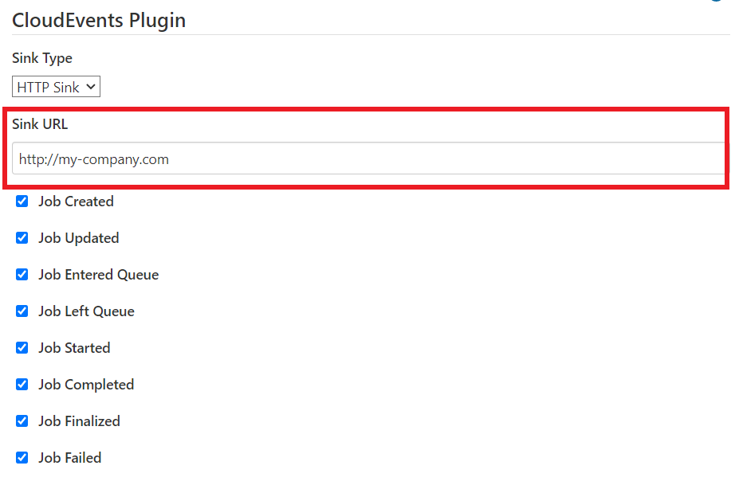
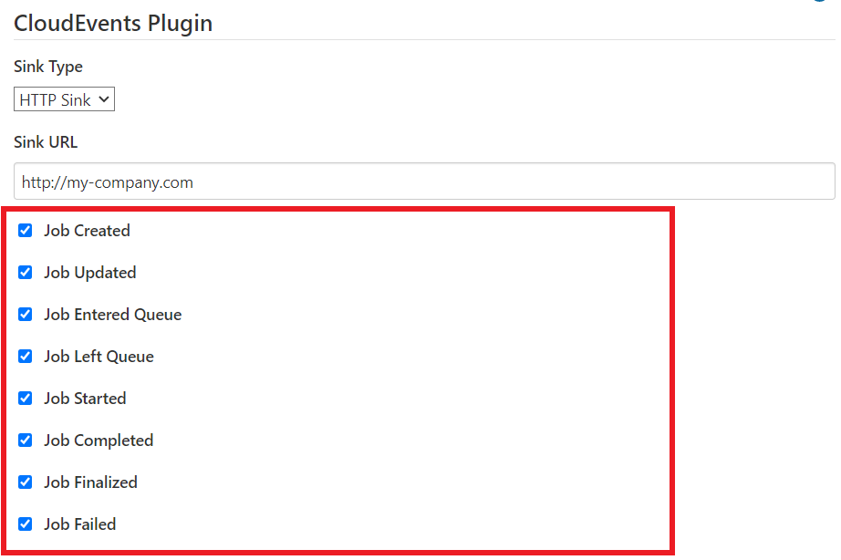

# CloudEvents-Plugin

## Introduction

The CloudEvents Plugin for Jenkins allows interoperability between different CI/CD tools by adopting industry-standard specification for events called [CloudEvents](https://cloudevents.io/). 

By using this plugin in your workflows, you can emit and consume CloudEvents for various events in Jenkins relating to Jenkins objects (jobs, projects, queues, etc).

The standardization of events by adopting CloudEvents will make it easier to interoperate systems without having to write adapters. 

## Getting started

There are 2 usages of this plugin:
1. **Jenkins as a Source.**
   
    1. To configure Jenkins as a Source, first click on *Manage Jenkins* in the Root-Actions menu on the left.
        
       
    2. Once you are in Manage Jenkins UI, search for *Configure System* under *System Configuration*. 
        
       
    3.  Inside the *Configure System* UI, scroll down to the *CloudEvents Plugin* section and configure the following: 
        - Select the type of the sink.
          
        - Enter the URL of the sink where requests from Jenkins will be routed.
          
        - Select the events this sink will receive.
          

2. **Jenkins as a Sink.**
    1. To use Jenkins as a Sink, enter the Jenkins Sink URL as the Sink to send CloudEvents from other systems.
    2. TODO: Jenkins Sink URL.

## Issues

TODO Decide where you're going to host your issues, the default is Jenkins JIRA, but you can also enable GitHub issues,
If you use GitHub issues there's no need for this section; else add the following line:

Report issues and enhancements in the [Jenkins issue tracker](https://issues.jenkins-ci.org/).

## Contributing

TODO review the default [CONTRIBUTING](https://github.com/jenkinsci/.github/blob/master/CONTRIBUTING.md) file and make sure it is appropriate for your plugin, if not then add your own one adapted from the base file

Refer to our [contribution guidelines](https://github.com/jenkinsci/.github/blob/master/CONTRIBUTING.md)
